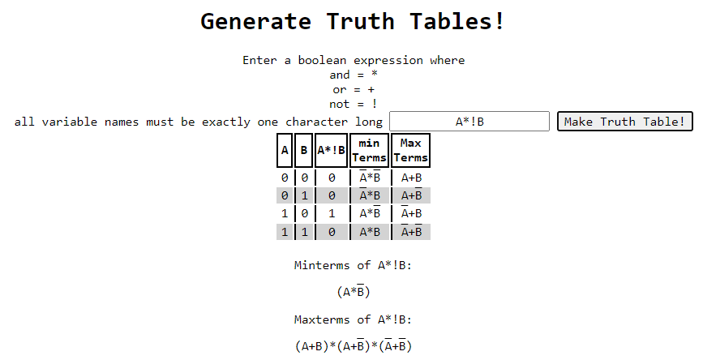
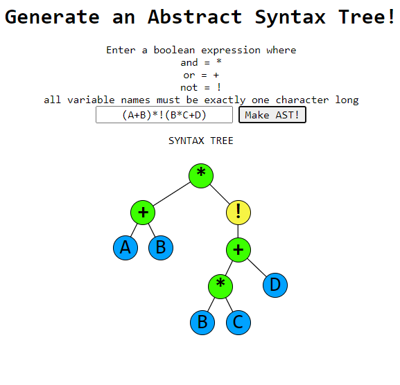
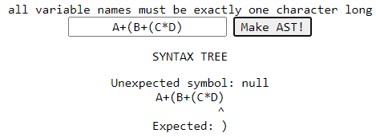

# COOL-MATH-WEBSITE
This is a browser based math website intended to help students such as myself learn math concepts in an interactive manner. You can generate a truth table or syntax tree visualization for any valid boolean expression.

# How to Run
Open the folder in VSCode and live-serve index.html.
Click GO under either heading to navigate to the respective page.

# Usage
### Truth Tables
This page allows you to generate truth tables from any valid boolean expression. Expressions can be entered using single character identifiers or constant 1's and 0's. AND, OR, and NOT operations are denoted by *, +, and ! respectively.

When a valid expression is entered, a corresponding truth table will be generated, as well as columns for the min and max terms associated with it.

Example Output:

The trees generated by the Abstract Syntax Tree Generator are evaluated to produce the values in the table, no eval() function required!

### Syntax Tree Generator

The input for the Syntax Tree Generator is used the same way as the Truth Table generator. On successful input, a visual representation of a syntax tree is generated.

These trees are evaluated using a depth-first search, from left to right. Trees are constructed taking into account operator precedence, parentheses can be used to enforce precedence.

Example Output for (A+B)*!(B*C+D)

Syntax errors are handled by the tree generator:

